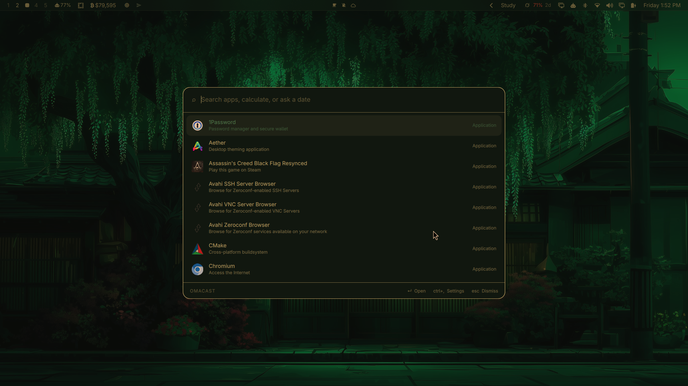

# Omacast

A keyboard launcher for [Omarchy](https://omarchy.org). One hotkey, one field:
fuzzy app search that learns what you actually open, a calculator with unit
conversion, date arithmetic, and your markdown notes — all in the same list.



## Why it is built this way

Omacast is a Quickshell **overlay plugin**, so the interface runs inside the
Omarchy shell process that is already on screen rather than in a browser engine
of its own. Search itself lives in a small Rust daemon that keeps the app index
in memory and answers over a unix socket.

The result is a launcher that costs about **9 MB** resident and answers a
keystroke in **~0.4 ms**, including the round trip. An equivalent build on a
webview stack measured 356 MB across three processes on the same machine.

```
   CTRL + SPACE
        │
        ▼
  Omacast.qml ── overlay, inside the running Quickshell process
        │         layer-shell, exclusive keyboard focus
        │  newline-delimited JSON over $XDG_RUNTIME_DIR/omacast.sock
        ▼
  omacastd ───── app index · fuzzy + frecency · calculator · dates · notes
```

## What it does

| Type this | You get |
|---|---|
| `firefox` | Fuzzy app search, ranked by how often and how recently you launch things |
| `1920 * 0.85` | `1632` — Enter copies it |
| `25 GB to MB`, `5 miles to km`, `0xff to decimal`, `15% of 240` | Unit, base and percentage conversion |
| `days until october 8` | `41 days — until Thursday, 8 October 2026` |
| `30 days from now`, `2 weeks ago` | The resulting date |
| `checklist` | Your markdown notes, matched on title and body |
| `note Groceries` | Creates that note and opens it |
| `clipboard` | Opens Omarchy's clipboard manager |
| `settings` | The settings pane |

Ranking is fuzzy relevance first, with a frecency boost — usage damped
logarithmically and decayed on a 14-day half-life — so familiar apps rise
without ever outranking a clearly better textual match. An empty query lists
what you open most.

### Keys

| Key | Action |
|---|---|
| `↑` `↓`, `Ctrl+N` `Ctrl+P` | Move through results (wraps) |
| `↵` | Open, or copy for calculator and date rows |
| `⇧↵` | Copy a calculation together with its expression |
| `Ctrl+,` | Settings |
| `Esc` | Clear the query, then dismiss |

## Install

Requires Omarchy (Quickshell 0.3+), Hyprland, and a Rust toolchain to build the
daemon. `wl-clipboard` is needed for copying.

```bash
omarchy plugin add https://github.com/Aditya-Raj-Tiwari/omacast.git --enable
cd ~/.config/omarchy/plugins/adityarajtiwari.omacast
make install
omacastd hotkey 'CTRL + SPACE'
```

`omacastd hotkey` writes `~/.config/hypr/omacast.lua` and adds one `dofile` line
to `hyprland.lua`. Wayland has no client-side global hotkey, so the binding has
to live in the compositor's config; keeping it in its own file makes it easy to
see and to remove.

Start the daemon at login by adding it to `~/.config/hypr/autostart.lua`:

```lua
hl.exec_once("omacastd")
```

The overlay also starts the daemon on demand if it isn't running.

## Settings

`Ctrl+,` or type `settings`. Everything is stored in
`~/.config/omacast/config.json` and applies immediately.

- **Hotkey** — click the field, press a combination; it rewrites the Hyprland binding and reloads.
- **Sources** — enable apps, calculator, dates and notes individually, cap how many rows each contributes, and set the notes folder.
- **Appearance** — width, visible rows, corner radius, and whether to follow the Omarchy theme.
- **Behaviour** — dismiss on click-away, what Escape does, and whether an empty query lists frequent apps.

## Notes

Notes are markdown files in `~/Notes` (configurable). Titles come from the first
`# heading`, falling back to the filename. Typing `note <title>` creates one and
opens it straight away, so capturing a thought is a single keystroke.

Notes open in [shadow-notes](https://github.com/Aditya-Raj-Tiwari), the floating
markdown scratchpad, which now takes a file path:

```bash
shadow-notes                 # the scratchpad, as before
shadow-notes ~/Notes/foo.md  # a specific note
```

Each note gets its own instance id, so opening a second note gives it a new
window while re-opening the same note focuses the one already on screen.

Titles are matched fuzzily and body text literally — a fuzzy match against a
whole document scores almost anything and buries the note you meant.

## Clipboard

Omarchy already ships a clipboard manager, so Omacast does not keep a second
history. Typing `clipboard` opens Omarchy's own overlay instead.

## Uninstall

```bash
make uninstall
omarchy plugin remove adityarajtiwari.omacast
```

Then delete the two `Added by omacast` lines from `~/.config/hypr/hyprland.lua`.

## Development

```bash
make dev     # symlink the working tree into the plugin dir, then rescan
make test    # daemon unit tests
make check   # clippy + omarchy plugin validate
omacastd eval '25 GB to MB'    # exercise the engines without the UI
```

Adding a search source means implementing one trait in `daemon/src/providers/`:

```rust
pub trait Provider: Send + Sync {
    fn id(&self) -> &'static str;
    fn query(&self, q: &Query) -> Vec<Item>;
    fn activate(&self, id: &str, action: Action) -> Result<Outcome>;
    fn reindex(&self) {}
}
```

`query` runs on every keystroke and must stay in the sub-millisecond range —
build the index in `reindex`, never in `query`.

## Licence

MIT
